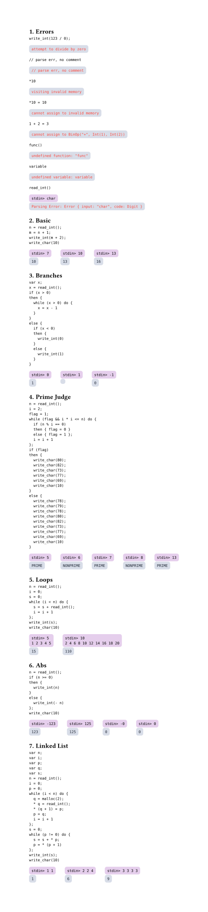

# whiledb-typ
[WhileDB](https://github.com/HellOwhatAs/While-DB)

## Example
Example: [example.typ](example.typ)  



## Build
```sh
cargo build --release --target wasm32-unknown-unknown

cp ./target/wasm32-unknown-unknown/release/whiledb_typ.wasm ./typst-package
```

Copy files in `./typst-package` to typst [Local packages](https://github.com/typst/packages#local-packages) (with namespace `local`)

Then whiledb-typ could be imported via
```typ
#import "@local/whiledb:0.1.0": *;
```